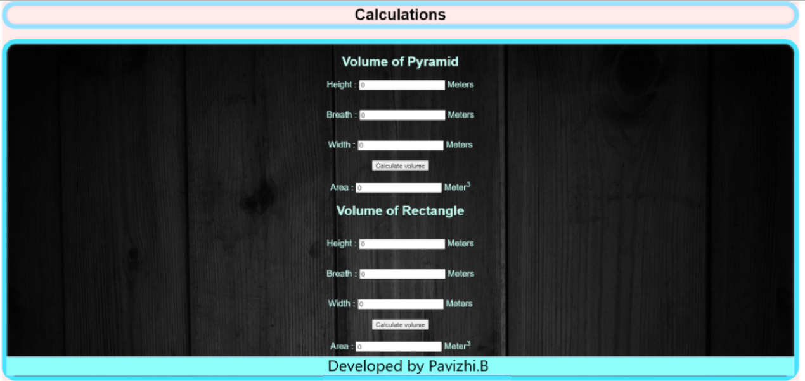
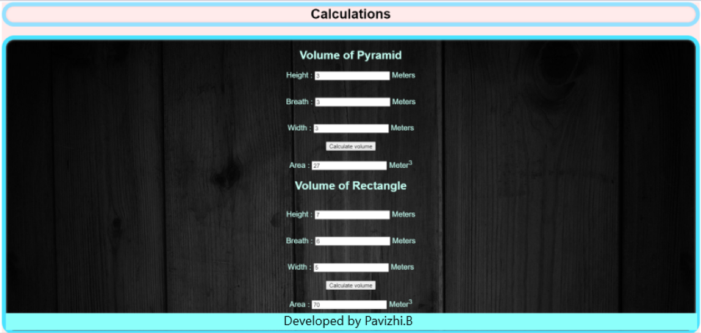

# AngularCalculation

# Web Page for Mathematical Calculations using Angular

## AIM:
To design a dynamic website to perform mathematical calculations using Angular Framwork

## DESIGN STEPS:

### Step 1:

Requirement collection.

### Step 2:

Creating the layout using HTML and CSS in component.html file

### Step 3:

Write typescript to perform the calculations.

### Step 4:

Validate the layout in various browsers.

### Step 5:

Validate the HTML code.

### Step 6:

Publish the website in the given URL.

## PROGRAM :
### app.component.html
```
<style>
    *{
        box-sizing:border-box;
        font-family: Arial, Helvetica, sans-serif;
    }
    body{
        background-color:rgb(255, 235, 235);
    }
    .container {
      width: auto;
      margin-left: auto;
      margin-right: auto;
      background-image: url(https://lea.verou.me/ft2010/img/darker_wood.jpg);
      box-shadow: inset 0 0 5px #b6b6b6; 
      backdrop-filter: blur(15px);
      border-radius: 30px;
      border: 10px solid #48e3ff;
    }

    .content2{
      display: block;
      text-align: center;
      color: rgb(198, 255, 243);
      padding-bottom: 10px;
      font-size: large;
    }
    
    .content{
     display: block;
    text-align: center;
    color: rgb(198, 255, 243);
    font-size: large;
    }

    h1{
        display: block;
        text-align: center;
        width: auto;
        margin-left: auto;
        margin-right: auto;
        font-color: rgb(198, 255, 243);
        box-shadow: inset 0 0 5px #ffc4c4; 
        backdrop-filter: blur(15px);
        border-radius: 30px;
        border: 10px solid #95e1ff;

    }
    

    .footer{
        display: block;
        width: 100%;
        height: 40px;
        background-color:#acf2ff;
        text-align: center;
        padding-top: 10px;
        margin: 0px 0px 0px 0px;
        color: #161616;
    }
</style>

<body>
    <h1>Calculations</h1>
    <div class="container">
        <div class="content">
            <h2>Volume of Pyramid</h2>
            <pyramid-Volume></pyramid-Volume>
        </div>
        <div class="content2">
            <h2>Volume of Rectangle</h2>
            <rectanglevolume></rectanglevolume>
        </div>
         <div class="footer">Developed by Pavizhi.B</div>
    </div>
</body>
```
### app.module.html
```
import { NgModule } from '@angular/core';
import { FormsModule } from '@angular/forms';
import { BrowserModule } from '@angular/platform-browser';


import { AppComponent } from './app.component';
import { pyramidcomponent } from './pyramid.component';
import { rectanglecomponent } from './rectangle.component';

@NgModule({
  declarations: [
    AppComponent,pyramidcomponent,rectanglecomponent
  ],
  imports: [
    BrowserModule,FormsModule
  ],
  providers: [],
  bootstrap: [AppComponent]
})
export class AppModule { }

```

### Pyramid.component.html
```

<div>
    Height : <input type="text" [(ngModel)]="height"> Meters<br/>
    <br/>
    <br/>
    Breath : <input type="text" [(ngModel)]="breath"> Meters<br/>
    <br/>
    <br/>
    Width : <input type="text" [(ngModel)]="width"> Meters<br/>
    <br/>
   
    <input type = "button" (click)="oncalculatevolume()" value="Calculate volume"><br/>
   
    <br/>
    Area : <input type="text" readonly value="0" [value]="volume"> Meter<sup>3</sup>

</div>
```

### Pyramid.component.ts
```

import { Component } from "@angular/core";

@Component({
    selector:'pyramid-Volume',
    templateUrl:'pyramid.component.html'
})
export class pyramidcomponent{
    height:number;
    breath:number;
    width:number;
    volume:number;
    constructor(){
        this.height = 0
        this.breath = 0
        this.width = 0

        this.volume = this.height*this.breath*this.width;
    }

    oncalculatevolume(){
        
        this.volume = this.height*this.breath*this.width;
    }
}

```


### Rectangle.component.html

```

<div>
    <br/>
    Height : <input type="text" [(ngModel)]="height1"> Meters<br/>
    <br/>
    <br/>
    Breath : <input type="text" [(ngModel)]="breath1"> Meters<br/>
    <br/><br/>
    Width : <input type="text" [(ngModel)]="width1"> Meters<br/>
    <br/>
    <input type = "button" (click)="oncalculatevolume()" value="Calculate volume"><br/>
    <br/>
    Area : <input type="text" readonly value="0" [value]="volume1"> Meter<sup>3</sup>
    <br/>
    
</div>
```

### Rectangle.component.ts
```

import { Component } from "@angular/core";

@Component({
    selector: 'rectanglevolume',
    templateUrl: 'rectangle.component.html'
  
})

export class rectanglecomponent{
    height1:number;
    breath1:number;
    width1:number;
    volume1:number;
    constructor(){
        this.height1 = 0
        this.breath1 = 0
        this.width1 = 0

        this.volume1 = (this.height1*this.breath1*this.width1)/3;
    }

    oncalculatevolume(){
        
        this.volume1 = (this.height1*this.breath1*this.width1)/3;
    }
}

```


## OUTPUT WITHOUT CALCULATION:

## OUTPUT WITH CALCULATION:



## Result:
The Math calculation is created by angular